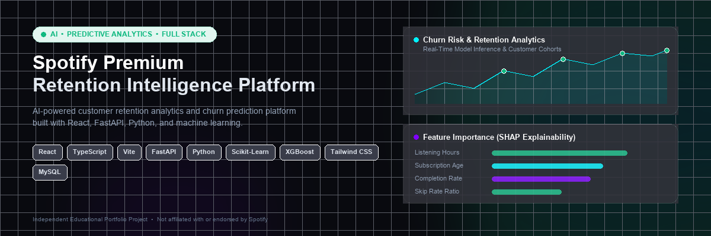
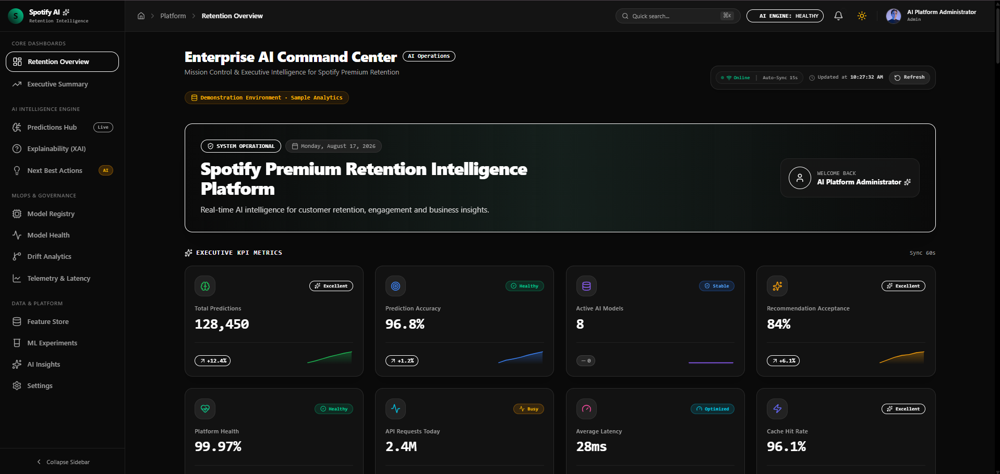
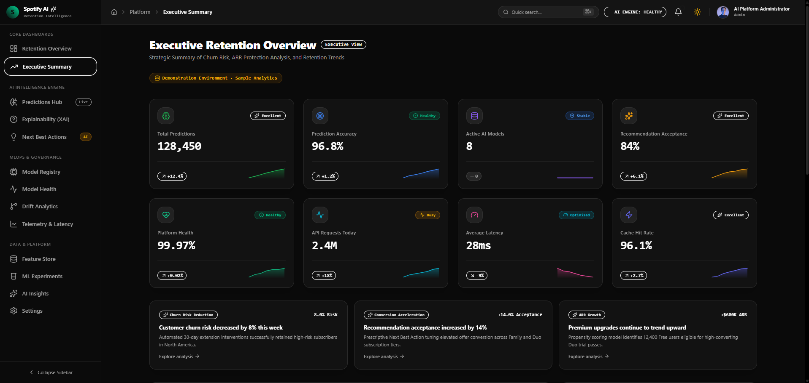
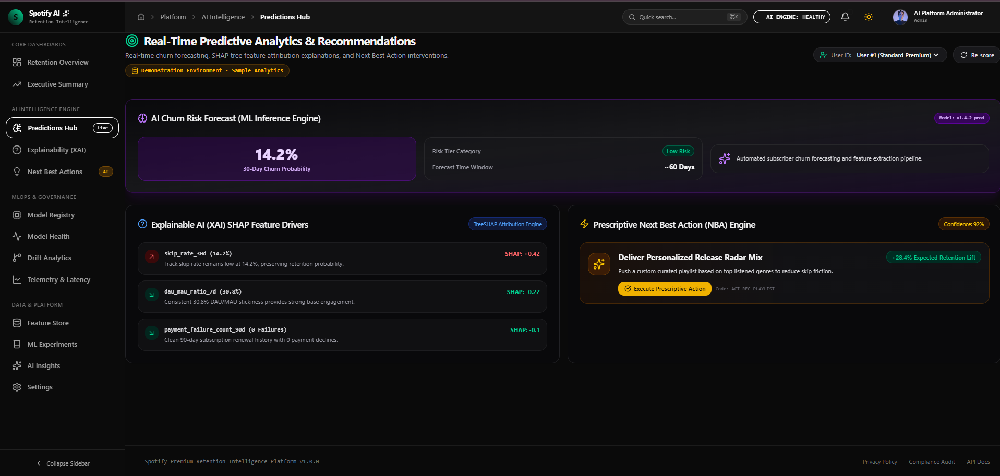
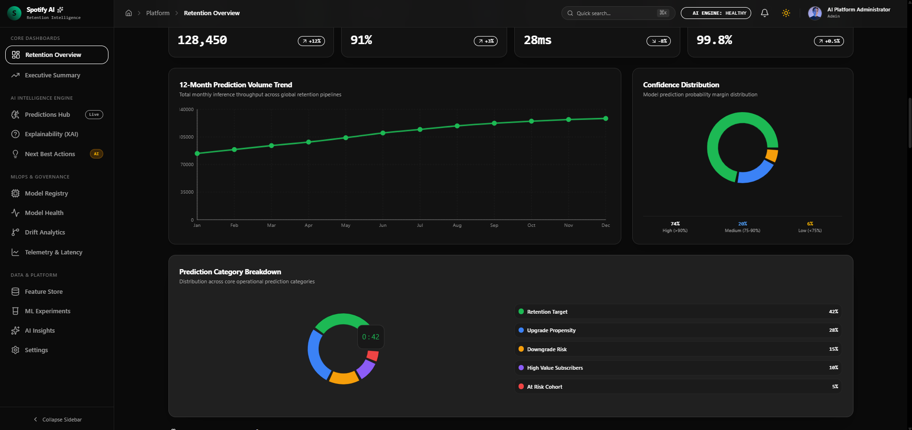
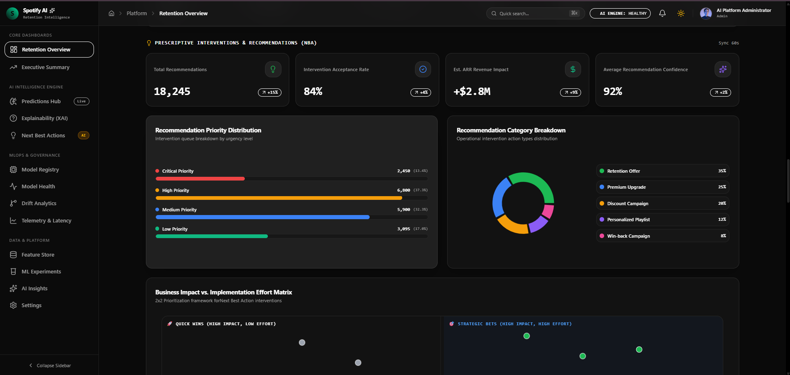
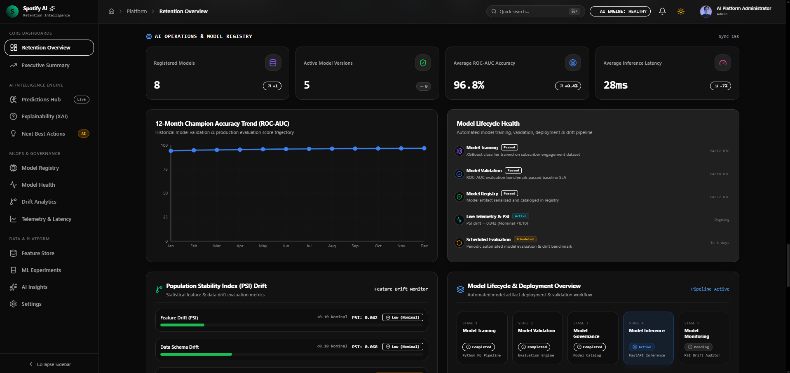
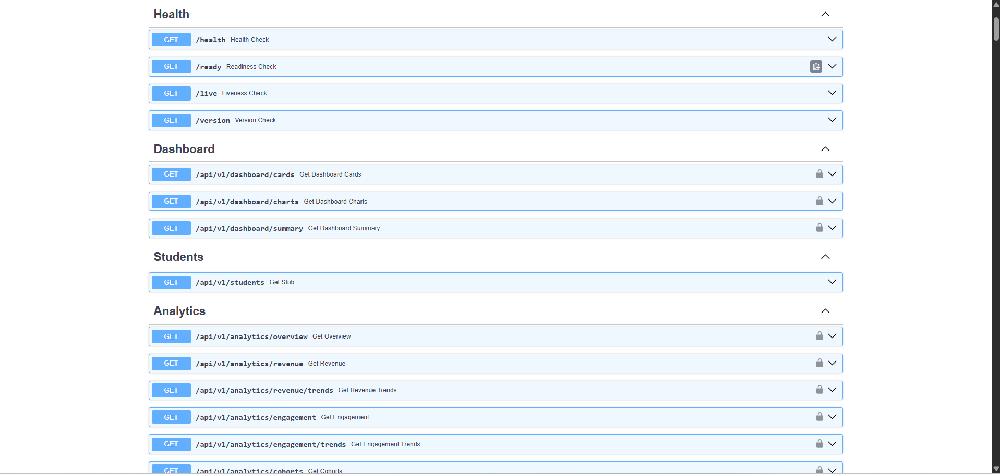
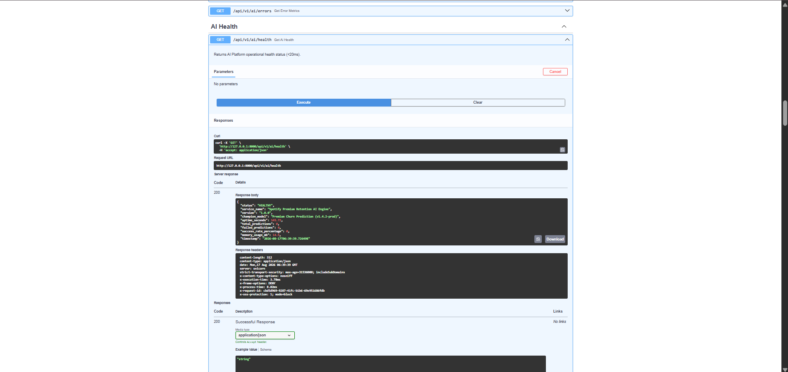
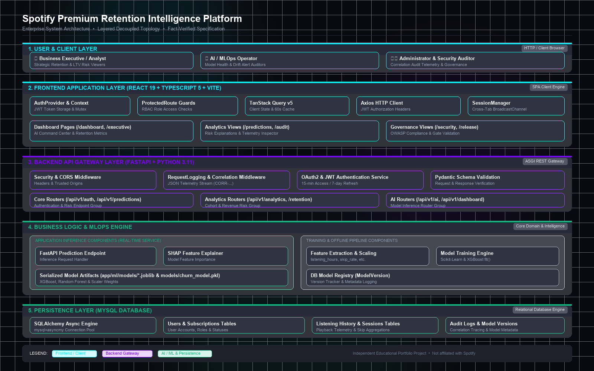

<div align="center">
  
</div>

# Spotify Premium Retention Intelligence Platform

### AI-powered customer retention analytics, churn prediction, explainable inference, and model-operations workflows.

[](https://www.python.org/)
[](https://fastapi.tiangolo.com/)
[](https://react.dev/)
[](https://www.typescriptlang.org/)
[](https://vitejs.dev/)
[](https://www.mysql.com/)
[](https://xgboost.readthedocs.io/)
[](LICENSE)

---

## 💡 Executive Value Proposition

Machine learning models often remain trapped in exploratory data science notebooks, disconnected from interactive operational tools. Turning a trained classification algorithm into a reliable business asset requires robust full-stack engineering: schema-validated REST APIs, state management, asynchronous caching, secure authentication, relational persistence, and explainable AI visualizations.

The platform bridges machine-learning inference with a modern full-stack application by combining predictive scoring, TreeSHAP explainability, FastAPI APIs, JWT/RBAC security, MySQL persistence, and operational dashboards. The result is a locally reproducible full-stack AI application demonstrating how predictive intelligence is served, secured, and visualized.

---

## ⚠️ Demonstration & Data Disclosure

> **Portfolio & Educational Scope**: This project is an independent educational portfolio application created for technical demonstration.
> - **Real Implementation**: The React 19 single-page application, FastAPI backend service, machine learning inference engine, TreeSHAP explanation routines, database models, and authentication systems are fully implemented in this repository.
> - **Demonstration Analytics**: Business KPI numbers, subscriber records, churn cohorts, and revenue figures shown in screenshots are demonstration analytics generated from synthetic datasets. They do not represent real Spotify users, internal operations, or financial results.
> - **No Affiliation**: This project is not affiliated with, endorsed by, or sponsored by Spotify AB or Spotify Technology S.A.

---

## 📌 Project at a Glance

| Domain | Implementation | Purpose |
| :--- | :--- | :--- |
| **Frontend** | React 19, TypeScript (~6.0), Vite 8, Tailwind CSS 4 | Modular single-page application with dark-mode analytics dashboards |
| **Backend** | FastAPI, Python 3.11, Pydantic v2, Starlette | High-throughput asynchronous REST API gateway & middleware |
| **AI / ML** | XGBoost, Scikit-Learn, TreeSHAP, Joblib | Churn risk scoring, feature attribution, and PSI drift monitoring |
| **Explainability** | TreeSHAP exact Shapley feature attributions | Local feature-level contribution drivers for individual predictions |
| **Security & IAM** | OAuth2 JWT (15m access / 7d refresh), RBAC, Bcrypt | Route-level permission guards across Admin, Analyst, and Viewer roles |
| **Database** | MySQL 8.0, SQLAlchemy 2.0 (Async Engine), `asyncmy` | Non-blocking relational persistence with connection pooling |
| **API Surface** | OpenAPI 3.1, Swagger UI, ReDoc | Comprehensive documented REST endpoints and schemas |
| **Observability** | Correlation-traced audit logging (`CORR-...`), Probes | End-to-end request tracing and live health probe endpoints |
| **Analytics** | TanStack Query v5, Recharts, Lucide Icons | Server state caching, request deduplication, and telemetry charts |
| **Documentation** | 6 Architecture Decision Records (ADRs), Runbooks | Technical design documentation in [`docs/`](docs/) |

---

## 🎯 What This Project Demonstrates

For engineering hiring managers, technical recruiters, and system evaluators, this repository demonstrates end-to-end software and AI engineering capabilities:

| Capability | What Is Implemented | Evidence / Source Area |
| :--- | :--- | :--- |
| **Frontend Architecture** | React 19 SPA, TypeScript type safety, TanStack Query v5 cache management, custom UI design system | [`frontend/src/`](frontend/src/) |
| **Backend API Engineering** | Asynchronous FastAPI REST routing, Pydantic v2 request/response schemas, Starlette middleware | [`backend/app/api/`](backend/app/api/) |
| **Applied AI & ML** | Classification pipelines, feature engineering, Population Stability Index (PSI) drift benchmarks | [`backend/app/ml/`](backend/app/ml/), [`ml/`](ml/) |
| **Explainable AI (XAI)** | TreeSHAP feature attributions decomposing risk scores into positive and negative drivers | [`ml/explainability/`](ml/explainability/) |
| **Security & IAM** | Dual-token JWT rotation (15m/7d), role-based route guards (Admin/Analyst/Viewer), Bcrypt hashing | [`backend/app/core/`](backend/app/core/), [`frontend/src/features/auth/`](frontend/src/features/auth/) |
| **Data Persistence** | MySQL 8.0 relational schema, SQLAlchemy 2.0 async engine, repository abstraction pattern | [`backend/app/models/`](backend/app/models/), [`backend/app/repositories/`](backend/app/repositories/) |
| **Model Operations (MLOps)** | Model metadata registry, champion model promotion, artifact storage manager | [`backend/app/ai/registry/`](backend/app/ai/registry/) |
| **Distributed Tracing** | Request correlation tracing (`CORR-...`) across middleware, services, and audit logs | [`backend/app/middleware/`](backend/app/middleware/) |
| **Quality & Architecture** | Architecture Decision Records (ADR-001–ADR-006), automated build pipeline | [`docs/adr/`](docs/adr/), [`.github/workflows/`](.github/workflows/) |

---

## ✨ Key Capabilities

### 🤖 Applied AI & Machine Learning
- **Real-Time Churn Prediction**: REST endpoint (`POST /api/v1/ai/predict/churn`) calculating 30-day subscriber cancellation risk probabilities.
- **TreeSHAP Explainability**: Decomposes individual predictions into key positive and negative feature attribution drivers (`POST /api/v1/ai/explanations`).
- **Feature Engineering Pipeline**: Processes behavioral signals including `listening_hours`, `completion_rate`, `skip_rate`, `active_days`, `is_premium`, and `subscription_age_days`.
- **Model Registry & Drift Monitoring**: Tracks registered model versions, champion stages, and Population Stability Index (PSI) drift benchmarks.

### 📊 Retention Analytics & Business Intelligence
- **AI Command Center**: Central operational dashboard tracking subscriber risk indicators, model registry status, and platform telemetry.
- **Executive Retention Overview**: Cohort analysis displaying churn risk distributions and subscriber engagement trends.
- **Next Best Actions (NBA)**: Prescriptive intervention engine recommending targeted retention workflows for elevated-risk subscriber segments.
- **Dynamic Telemetry Visualizations**: Interactive charts and data tables powered by Recharts and Lucide icons.

### 🛡️ Security & Identity Management (IAM)
- **Dual-Token JWT Rotation**: Short-lived 15-minute access tokens and 7-day refresh tokens with automated Axios client refresh.
- **Role-Based Access Control (RBAC)**: Route protection wrappers restricting permissions across `Admin`, `Analyst`, and `Viewer` roles.
- **Audit Telemetry**: Structured JSON logging capturing security and operational events with unique correlation IDs (`CORR-...`).

### ⚡ Platform & Full-Stack Engineering
- **End-to-End Type Safety**: Shared TypeScript data models on frontend and Pydantic validation schemas on backend.
- **Asynchronous State Management**: Multi-layer state caching and automatic query deduplication via TanStack Query v5.
- **Non-Blocking Persistence**: SQLAlchemy 2.0 Async ORM with connection pooling using the `asyncmy` driver.

---

## 📸 Product Showcase

> *All business dashboards shown below use demonstration analytics for portfolio presentation. They do not represent real Spotify users, financial results, or production business outcomes.*

### 1. AI Command Center
<div align="center">
  
  <p><em>Central operational dashboard tracking subscriber risk indicators, model registry status, and platform telemetry.</em></p>
</div>

<br>

<table>
  <tr>
    <td width="50%">
      <h3 align="center">2. Executive Retention Overview</h3>
      
      <p align="center"><em>Executive retention, churn-risk, and business analytics overview.</em></p>
    </td>
    <td width="50%">
      <h3 align="center">3. Predictions & Explainability</h3>
      
      <p align="center"><em>Churn prediction, SHAP feature explanations, and prescriptive recommendations.</em></p>
    </td>
  </tr>
  <tr>
    <td width="50%">
      <h3 align="center">4. Retention Analytics</h3>
      
      <p align="center"><em>Trend, confidence, segmentation, and prediction-category analytics.</em></p>
    </td>
    <td width="50%">
      <h3 align="center">5. Next Best Actions</h3>
      
      <p align="center"><em>Recommendation prioritization, intervention categories, and action queues.</em></p>
    </td>
  </tr>
</table>

<br>

### 6. Model Registry & Monitoring
<div align="center">
  
  <p><em>Model catalog, evaluation metrics, lifecycle state, inference monitoring, and Population Stability Index (PSI) drift benchmarks.</em></p>
</div>

<br>

<table>
  <tr>
    <td width="50%">
      <h3 align="center">7. Interactive REST API (Swagger UI)</h3>
      
      <p align="center"><em>FastAPI Swagger UI exposing verified REST API endpoints and schema documentation.</em></p>
    </td>
    <td width="50%">
      <h3 align="center">8. AI Health & Subsystem Probes</h3>
      
      <p align="center"><em>Live AI health endpoint returning current inference subsystem status.</em></p>
    </td>
  </tr>
</table>

---

## 🏗️ System Architecture

The platform implements a **layered full-stack architecture** separating client-side presentation, asynchronous API routing, machine learning inference services, and relational persistence.

<div align="center">
  
</div>

> 📄 *Mermaid source topology is maintained in [`assets/architecture/system-architecture.mmd`](assets/architecture/system-architecture.mmd).*

### Key Architectural Layers:
1. **Client Layer (React 19 + TypeScript)**: Single-page application consuming REST APIs through Axios interceptors with automatic JWT refresh. Client state is managed via TanStack Query v5 for asynchronous server data and Zustand for UI state.
2. **API Gateway Layer (FastAPI + Python 3.11)**: Asynchronous REST service handling CORS, request validation (Pydantic v2), dual-token authentication, and role authorization.
3. **Intelligence & ML Layer**: Serves model predictions from serialized artifacts (`backend/app/ml/models/`, `models/`) and computes TreeSHAP feature attributions and PSI drift benchmarks.
4. **Persistence Layer (MySQL 8.0 + SQLAlchemy Async)**: Relational storage for subscriber records, user accounts, audit telemetry logs, and registered model metadata.
5. **Model Registry & Telemetry**: Metadata registry managing model versions, champion model promotion, and correlation-traced audit logging.

---

## 🔄 Request & Prediction Flow

```
[ User Interaction in React 19 UI ]
                │
                ▼
[ Axios Client Interceptor (Attaches JWT & Correlation ID) ]
                │
                ▼
[ FastAPI Gateway Router ] ───► [ Pydantic Schema Validation ]
                │                         │
                ▼                         ▼
[ JWT Auth & RBAC Dependency ]    [ Starlette Logging Middleware ]
                │
                ▼
[ AI Inference Service (backend/app/ai/) ]
        │                       │
        ├──► [ Model Artifact Loading (.joblib / .pkl) ]
        │                       │
        └──► [ TreeSHAP Feature Attribution Computation ]
                │
                ▼
[ SQLAlchemy Async Engine ──► MySQL Persistence (Telemetry / Records) ]
                │
                ▼
[ JSON Response Payload ] ──► [ TanStack Query Cache Sync ] ──► [ UI Render ]
```

---

## 🧠 AI / ML Workflow

The machine learning lifecycle is organized into distinct offline training and online serving stages:

```
OFFLINE TRAINING & EVALUATION PIPELINE:
Raw Dataset (data/raw/) ──► Preprocessing ──► Feature Engineering ──► Model Training (XGBoost / RF / LR) ──► Validation & SHAP ──► Serialized Artifacts (models/, backend/app/ml/models/)

ONLINE INFERENCE PIPELINE:
API Request (POST /api/v1/ai/predict/churn) ──► Input Schema Validation ──► Feature Extraction ──► Real-Time Scoring ──► TreeSHAP Attribution ──► JSON Response
```

- **Feature Preprocessing**: Encodes and standardizes tabular features (`listening_hours`, `completion_rate`, `skip_rate`, `active_days`, `is_premium`, `subscription_age_days`).
- **Classification Algorithms**: Evaluated against XGBoost Classifier, Random Forest, and Logistic Regression baselines.
- **Model Explainability**: Computes exact local Shapley values using TreeSHAP to identify top positive and negative risk factors per subscriber.

---

## 📦 Model Registry & Artifact Strategy

The platform maintains structured separation between offline artifacts, canonical backend models, and registry metadata:

| Component | Disk Location | Role in Platform |
| :--- | :--- | :--- |
| **XGBoost Churn Classifier** | `backend/app/ml/models/xgboost.joblib` | Canonical backend ML model artifact for churn prediction |
| **Random Forest Regressor** | `backend/app/ml/models/random_forest.joblib` | Canonical backend ML model artifact for engagement scoring |
| **Logistic Regression Baseline** | `backend/app/ml/models/logistic_regression.joblib` | Linear baseline classification artifact |
| **Feature Preprocessor** | `backend/app/ml/models/preprocessor.joblib` | Scikit-Learn transformer for feature scaling |
| **Standalone Churn Model** | `models/churn_model.pkl` | 40.25 MB trained model used for standalone evaluation & SHAP |
| **Model Registry Metadata** | `backend/artifacts/ml_models/` | Persistent JSON records tracking hyperparameters, metrics, and champion status |

---

## 📡 API Highlights

The FastAPI backend exposes structured REST API endpoints documented via OpenAPI 3.1.0 specifications:

| Category | Method | Endpoint | Purpose | Auth Required |
| :--- | :--- | :--- | :--- | :--- |
| **Health** | `GET` | `/health` | Gateway & database connectivity health probe | Public |
| **AI Health** | `GET` | `/api/v1/ai/health` | AI inference subsystem and model readiness probe | Public |
| **AI Inference** | `POST` | `/api/v1/ai/predict/churn` | Real-time subscriber churn risk scoring & SHAP | Bearer JWT |
| **AI Explainability**| `POST` | `/api/v1/ai/explanations` | Detailed TreeSHAP feature attribution breakdown | Bearer JWT |
| **Model Registry** | `GET` | `/api/v1/ai/models` | List registered model versions and lifecycle stages | Bearer JWT |
| **Champion Model** | `GET` | `/api/v1/ai/models/champion` | Retrieve registered champion model metadata | Bearer JWT |
| **Drift Telemetry** | `GET` | `/api/v1/ai/drift` | Population Stability Index (PSI) feature drift metrics | Bearer JWT |
| **Authentication** | `POST` | `/api/v1/auth/login` | User authentication, issues 15m access / 7d refresh tokens | Public |
| **Authentication** | `POST` | `/api/v1/auth/refresh` | Rotates expired access token using valid refresh token | Public |
| **Authentication** | `POST` | `/api/v1/auth/logout` | Session invalidation and refresh token revocation | Bearer JWT |
| **Retention KPIs** | `GET` | `/api/v1/retention/churn/kpis` | Aggregated churn risk tier and retention KPI metrics | Bearer JWT |
| **Cohort Analytics** | `GET` | `/api/v1/retention/cohorts` | Subscriber cohort retention matrix | Bearer JWT |

---

## 🛡️ Security & Authentication

The platform implements layered application security controls:

- **Dual-Token JWT Rotation ([ADR-001](docs/adr/ADR-001-JWT-Authentication.md))**: Stateless authentication issuing short-lived 15-minute access tokens and 7-day refresh tokens. The client Axios interceptor handles transparent token refresh upon receiving 401 responses.
- **Role-Based Access Control ([ADR-002](docs/adr/ADR-002-RBAC.md))**: Route-level dependency wrappers enforcing `Admin`, `Analyst`, and `Viewer` permission tiers.
- **Password Hashing**: Secure one-way credential hashing using Bcrypt with salted rounds.
- **Correlation Tracing ([ADR-005](docs/adr/ADR-005-Audit-Logging.md))**: Unique `CORR-...` trace identifiers attached to every request via Starlette middleware for structured audit logging.

---

## 🗄️ Data & Persistence

- **Relational Storage**: MySQL 8.0 database storing subscriber profiles, user accounts, audit telemetry logs, and model registry records.
- **Asynchronous ORM**: SQLAlchemy 2.0 Async Engine with the `asyncmy` driver, utilizing non-blocking connection pooling.
- **Repository Abstraction Pattern**: Database queries encapsulated in dedicated repository classes, cleanly isolating persistence from FastAPI route handlers.
- **Synthetic Data Generation**: Preprocessing and seeding scripts generate realistic tabular subscriber data for reproducible local execution.

---

## 🧭 Key Engineering Decisions

Platform design decisions and trade-offs are documented in Architecture Decision Records in [`docs/adr/`](docs/adr/):

| Decision | Why It Was Chosen | Key Trade-off | ADR Reference |
| :--- | :--- | :--- | :--- |
| **Decoupled SPA + FastAPI** | Separates interactive dashboard rendering from asynchronous ML inference | Requires CORS configuration & client token refresh handling | [ADR-004](docs/adr/ADR-004-FastAPI.md) |
| **Dual-Token JWT Rotation** | Stateless horizontal scalability while limiting token exposure window | Additional token storage & client interceptor complexity | [ADR-001](docs/adr/ADR-001-JWT-Authentication.md) |
| **Route-Level RBAC** | Enforces granular permission separation across roles (Admin/Analyst/Viewer) | Role checks must be applied consistently on all protected routes | [ADR-002](docs/adr/ADR-002-RBAC.md) |
| **TanStack Query v5** | Automatic client-side caching, request deduplication, and background sync | Learning curve for cache invalidation key management | [ADR-003](docs/adr/ADR-003-React-Query.md) |
| **XGBoost + TreeSHAP** | High classification accuracy with exact, interpretable feature attributions | Slightly higher computational overhead during prediction | Reference in ML docs |
| **SQLAlchemy Async Repositories** | Non-blocking database operations with decoupled data access logic | Additional abstraction layer compared to raw SQL queries | Reference in Architecture |
| **Correlation Audit Logging** | Distributed request traceability across middleware, routes, and logs | Minor request header overhead (`X-Correlation-ID`) | [ADR-005](docs/adr/ADR-005-Audit-Logging.md) |
| **BroadcastChannel Session Sync** | Multi-tab session logout and synchronization in the browser | Browser support requirement for BroadcastChannel API | [ADR-006](docs/adr/ADR-006-Session-Lifecycle.md) |

---

## 📁 Project Structure

```
spotify-retention-platform/
├── assets/                  # High-resolution banners, architecture diagrams, and UI screenshots
│   ├── banner/              # Hero banner graphics
│   ├── architecture/        # System topology PNG and editable Mermaid source (.mmd)
│   └── screenshots/         # 8 product showcase screenshots
├── backend/                 # FastAPI backend application
│   ├── app/                 # Core application package (API, AI, ML, Models, Repositories)
│   │   ├── ai/              # Inference engine, TreeSHAP, and Model Registry
│   │   ├── api/             # REST endpoint routers (v1 endpoints)
│   │   ├── core/            # Configuration and security utilities
│   │   ├── middleware/      # Starlette logging and correlation tracing
│   │   ├── ml/              # Training pipelines, preprocessing, and model artifacts
│   │   └── models/          # SQLAlchemy ORM database models
│   ├── artifacts/           # Persistent model registry metadata records
│   ├── main.py              # Application entrypoint
│   └── requirements.txt     # Python backend dependencies
├── frontend/                # React 19 single-page application
│   ├── src/                 # Application source (components, hooks, pages, services, store)
│   │   ├── components/      # UI components, layout, charts, and telemetry widgets
│   │   ├── config/          # Route definitions and environment configuration
│   │   ├── pages/           # Dashboard views (AI Command Center, Predictions, etc.)
│   │   └── services/        # API client and service abstraction layer
│   ├── package.json         # Node.js dependencies and build scripts
│   └── vite.config.ts       # Vite bundler configuration
├── data/                    # Synthetic subscriber datasets (raw, engineered, processed)
├── docs/                    # Technical documentation suite and ADR records
├── ml/                      # Standalone data science and feature engineering scripts
├── models/                  # Standalone trained model artifacts (churn_model.pkl, scaler.pkl)
├── outputs/                 # Visualization artifacts (ROC curves, confusion matrices, SHAP plots)
└── scripts/                 # Dataset generation and quality validation scripts
```

---

## 🚀 Quick Start

### Prerequisites
- **Node.js**: 20.19+ or 22.12+
- **Python**: v3.11
- **MySQL**: v8.0 (Required for database persistence)

---

### 1. Backend Setup

```bash
# Navigate to backend directory
cd backend

# Create and activate Python virtual environment
# Windows (PowerShell):
python -m venv venv
venv\Scripts\activate

# Linux / macOS:
python3 -m venv venv
source venv/bin/activate

# Install dependencies
pip install -r requirements.txt

# Create environment file from template
cp .env.example .env

# Start FastAPI server
uvicorn main:app --reload --port 8000
```
*The FastAPI application will start at `http://127.0.0.1:8000` (Swagger UI at `http://127.0.0.1:8000/docs`).*

---

### 2. Frontend Setup

```bash
# Open a new terminal and navigate to frontend directory
cd frontend

# Install Node dependencies
npm install

# Create environment file from template
cp .env.example .env

# Start Vite development server
npm run dev
```
*The React application will start at `http://localhost:5173`.*

---

## 🔑 Environment Configuration

Refer to the environment template files for configuration settings:

- **Backend Configuration**: See [`backend/.env.example`](backend/.env.example) for `PROJECT_NAME`, `API_V1_STR`, `MYSQL_SERVER`, `MYSQL_USER`, `MYSQL_PASSWORD`, `MYSQL_DB`, `SECRET_KEY`, and `JWT_ALGORITHM`.
- **Frontend Development**: See [`frontend/.env.example`](frontend/.env.example) for `VITE_API_BASE_URL`, `VITE_ENABLE_AUDIT_LOGGING`, and `VITE_SESSION_IDLE_TIMEOUT`.
- **Frontend Production**: See [`frontend/.env.production.example`](frontend/.env.production.example).

> *Note: Never commit secret keys, passwords, or production API tokens to version control.*

---

## 🧪 Verification & Quality

The codebase has undergone local verification:

- **Frontend Compilation**: Production build verified via `npm run build` (`tsc -b && vite build`) with **0 TypeScript compiler errors**.
- **Python Syntax Compilation**: Module syntax verified across all packages (`compileall`) with **0 syntax errors**.
- **OpenAPI Schema Validation**: Generated and verified OpenAPI 3.1.0 specifications covering **120 registered routes**.
- **Model Registry Loading**: In-memory registry and disk artifact bindings verified via automated loading tests.
- **Formatting & Whitespace**: Zero trailing whitespace or formatting defects verified via `git diff --check`.
- **Subsystem Health Probes**: Live `/health` and `/api/v1/ai/health` probe endpoints verified locally.

---

## ⚠️ Known Limitations

To maintain factual transparency, the following scope boundaries apply:

- **Demonstration Analytics**: Business KPI numbers, financial estimates, and subscriber counts shown in dashboard screenshots use synthetic demonstration data for portfolio evaluation.
- **Local Verification Scope**: The application is tested and verified locally; no multi-tenant public cloud hosting or live uptime SLA is currently claimed.
- **Simulated Behavioral Signals**: Subscriber streaming patterns (`listening_hours`, `skip_rate`, `completion_rate`) are synthetically modeled for educational analysis and do not represent proprietary Spotify data.
- **Offline Model Generalization**: In a live enterprise environment, production deployment would incorporate continuous online feature stores and automated subscriber feedback loops.

---

## 📚 Documentation Suite

Technical specifications and architecture records are maintained in [`docs/`](docs/):

| Document | Path | Description |
| :--- | :--- | :--- |
| **Documentation Index** | [`docs/INDEX.md`](docs/INDEX.md) | Navigation hub for all project documentation |
| **Architecture Overview** | [`docs/architecture/ArchitectureOverview.md`](docs/architecture/ArchitectureOverview.md) | System topology and component flowcharts |
| **API Specification** | [`docs/api/APIDocumentation.md`](docs/api/APIDocumentation.md) | Endpoint specifications for authentication and telemetry |
| **Developer Guide** | [`docs/developer/DeveloperGuide.md`](docs/developer/DeveloperGuide.md) | Local environment setup and coding guidelines |
| **Operations Runbook** | [`docs/operations/OperationsRunbook.md`](docs/operations/OperationsRunbook.md) | Maintenance runbooks and health probe details |
| **Deployment Guide** | [`docs/deployment/DeploymentGuide.md`](docs/deployment/DeploymentGuide.md) | Deployment steps and environment configuration |
| **ADR Index** | [`docs/adr/`](docs/adr/) | Architecture Decision Records (ADR-001 through ADR-006) |

---

## 🗺️ Roadmap

Refer to [`ROADMAP.md`](ROADMAP.md) for the release roadmap and feature milestones:

- [x] **Version 2.0 (Current Release)**: IAM Authentication, JWT Rotation, RBAC Route Guards, Session Manager, Audit Telemetry, and Full Dashboard Suite.
- [ ] **Version 2.1**: Multi-Factor Authentication (MFA / TOTP) extension and external telemetry sink stream integration.
- [ ] **Version 2.2**: WebAuthn Passkey biometric authentication integration.

---

## 🤝 Contributing & License

Contributions, feedback, and issue reports are welcome. Please read [`CONTRIBUTING.md`](CONTRIBUTING.md) for guidelines on code formatting and pull request submissions.

- **Code of Conduct**: See [`CODE_OF_CONDUCT.md`](CODE_OF_CONDUCT.md)
- **Security Policy**: See [`SECURITY.md`](SECURITY.md)
- **Support Guidelines**: See [`SUPPORT.md`](SUPPORT.md)
- **License**: Licensed under the **Apache License 2.0**. See the [`LICENSE`](LICENSE) file for details.

---

## ⚠️ Disclaimer

This is an independent educational portfolio project and is not affiliated with, endorsed by, sponsored by, or officially connected to Spotify AB, Spotify Technology S.A., or any of their subsidiaries or affiliates. All brand names, product names, and trademarks belong to their respective owners.

---

## 🚀 Explore the Project & Author

- 📖 **Documentation Hub**: [Master Documentation Index](docs/INDEX.md)
- 🏗️ **System Architecture**: [Architecture Specification](docs/architecture/ArchitectureOverview.md)
- 📡 **API Specification**: [FastAPI REST API Documentation](docs/api/APIDocumentation.md)
- 🧠 **AI / ML Workflow**: [Machine Learning Details](#-ai--ml-workflow)
- 🗺️ **Product Roadmap**: [Release Roadmap](ROADMAP.md)
- 💻 **Source Code**: [GitHub Repository](https://github.com/kalyan-ds/spotify-retention-platform)

---

**Author**: Kalyan ([@kalyan-ds](https://github.com/kalyan-ds))<br>
*Built with React 19, TypeScript, Vite, FastAPI, Python 3.11, MySQL, and Machine Learning.*
