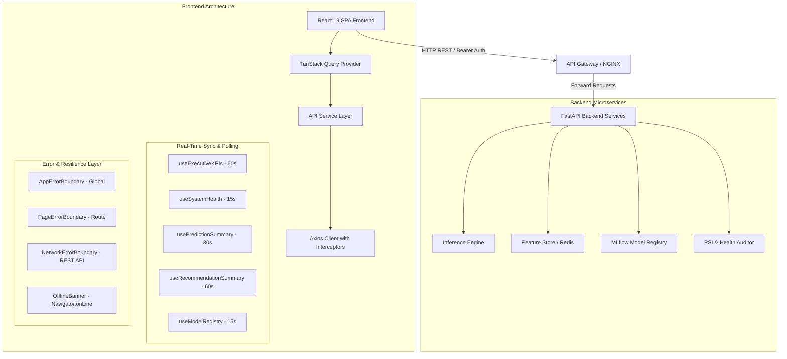

# Spotify Premium Retention Intelligence Platform - Technical Architecture

**Document Version**: 1.0.0
**Author**: Principal Software Architect & Enterprise Architecture Review Board (ARB)
**Status**: Approved & Certified

---

## 1. Executive Architecture Summary

The **Spotify Premium Retention Intelligence Platform** is architected as an enterprise-grade AI Operations (MLOps) Mission Control dashboard. It provides real-time visibility into customer churn risk predictions, prescriptive Next Best Action (NBA) interventions, model performance monitoring (ROC-AUC), Population Stability Index (PSI) feature drift, and microservice SLA health.

---

## 2. High-Level Component Architecture



---

## 3. Layered Design Specification

### 3.1 Presentation Layer (`/components/dashboard`, `/pages/dashboard`)
- Built using **React 19** functional components with strict **TypeScript** typing.
- Styled using **Tailwind CSS v4** with a custom dark-mode Spotify palette (`#1DB954` Spotify Green, `#121212` Surface Dark).
- Micro-animations handled via **Framer Motion 12** (`fade-in`, `slide-up`, hover lifts).

### 3.2 State Management & Synchronization (`/hooks`, `/lib`)
- Powered by `@tanstack/react-query` v5.
- Implements domain-driven polling intervals:
  - **Executive KPIs**: 60s
  - **AI Health**: 15s
  - **Predictions**: 30s
  - **Recommendations**: 60s
  - **AI Operations**: 15s
  - **Operations Center**: 10s
- Supports automatic background pause (`refetchIntervalInBackground: false`), network reconnection sync (`refetchOnReconnect: true`), and query deduplication.

### 3.3 HTTP Service Layer (`/services/api`)
- Encapsulated service classes (`DashboardService`, `PredictionService`, `RecommendationService`, `MonitoringService`, `ModelService`).
- **Axios Interceptor Capabilities**:
  - Injects JWT Bearer tokens from secure local storage.
  - Injects `X-Correlation-ID` header (`req-timestamp-uuid`) for end-to-end tracing.
  - Measures request latency via `PerformanceMonitor.trackApiLatency()`.
  - Formats standard REST errors into sanitized application objects.

### 3.4 Resilience & Security Layer (`/components/error`, `/components/shared`)
- **Global Error Boundaries**: Hierarchy of `AppErrorBoundary`, `PageErrorBoundary`, and `NetworkErrorBoundary` prevents single-component crashes from breaking the application shell.
- **Offline Support**: `useOnlineStatus` hook detects network drops, prompting the `OfflineBanner` to render while displaying cached query data.

---

## 4. Directory Structure Blueprint

```
frontend/src/
├── components/
│   ├── common/              # Page layout containers and headers
│   ├── dashboard/           # Dashboard feature cards, charts, grids, tables
│   ├── error/               # AppErrorBoundary, PageErrorBoundary, NetworkErrorBoundary
│   ├── layout/              # Header, Sidebar, Navigation
│   └── shared/              # DashboardLoading, DashboardError, DashboardEmpty, RefreshIndicator, OfflineBanner
├── config/                  # Centralized runtime configuration (config.ts)
├── hooks/                   # Custom hooks (useDashboard, useMonitoring, usePredictions, useRecommendations, useModels, useOnlineStatus, useAutoRefresh)
├── lib/                     # QueryClient instance & refreshIntervals.ts
├── pages/                   # Application route views (AICommandCenter.tsx)
├── providers/               # AppProvider, QueryProvider, ThemeProvider
├── services/api/            # Axios client, endpoint contracts, static service classes
├── types/                   # API contracts (api.ts) & domain types (dashboard.ts)
└── utils/                   # Structured logger.ts & performance.ts timing monitor
```
