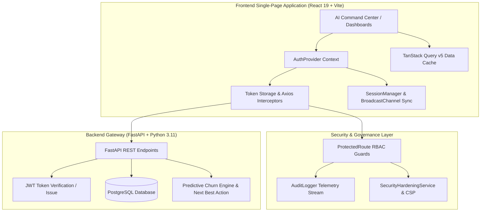

# Enterprise Architecture Overview - Spotify Premium Retention Platform

**Project**: Spotify Premium Retention Intelligence Platform
**Version**: 2.0.0 (Production Release)
**System Class**: Enterprise AI & Predictive MLOps Command Center

---

## 1. System Architecture Diagram

---

## 2. Platform Core Subsystems

1. **Authentication & Identity Access Management (IAM)**: REST JWT authentication, token refresh rotation, and password entropy evaluation.
2. **Role-Based Access Control (RBAC)**: Fine-grained permission guards (`Admin`, `Analyst`, `Viewer`) protecting dashboard routes.
3. **Session Lifecycle Management**: 15-minute idle monitoring, 2-minute expiration warning modal, and cross-tab `BroadcastChannel` synchronization.
4. **Audit Telemetry & Logging**: Real-time event recording with unique correlation IDs, payload inspection, and CSV/JSON exports.
5. **Security Hardening & Governance**: OWASP Top 10 mitigation matrix, error message sanitization, and Content Security Policy directives.
6. **AI Command Center & Predictive Engine**: Real-time churn prediction, feature drift monitoring, and Next Best Action interventions.
